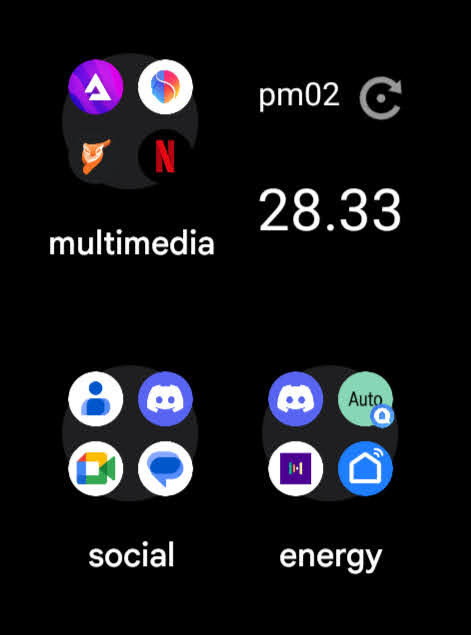
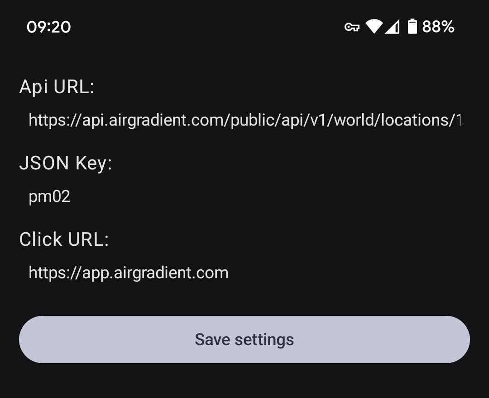

# ValueFromJsonWidget
## Screenshots
### Widget
  
### Settings
  
## Installation
1.  Go to the "Releases" section of this repository.
2.  Download the latest APK file.
3.  Install the APK on your Android device.  You may need to enable installation from unknown sources in your device settings.